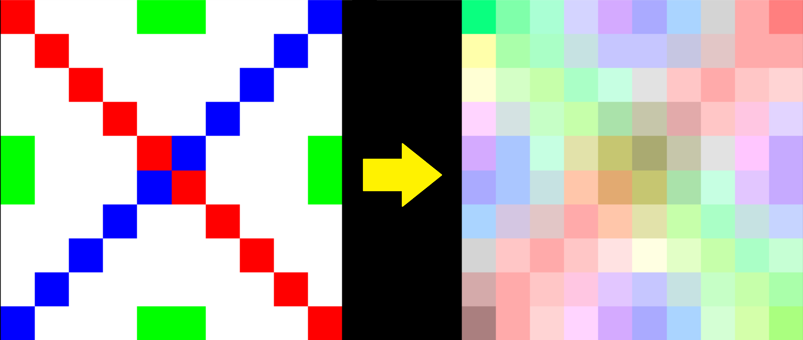

# Gaussian Blur in Parallel using Cuda

A simple command line tool written in C++ and Cuda for applying the Guassian Blur.

## Sample

    parallel.x 1 calibrate.ppm out.ppm

### Compilation

    make

### Execution

    parallel.x <radius> <input_image> <output_image>

    radius - radius of the blur
    input_image - image to process
    output_image - result

 Group project for the course 4F03 at McMaster University
